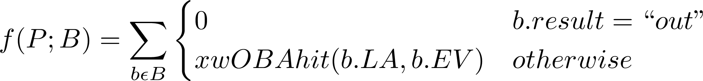
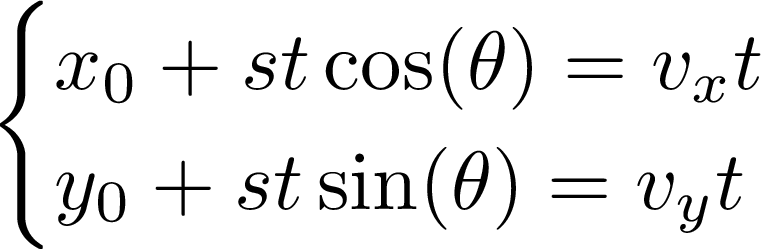
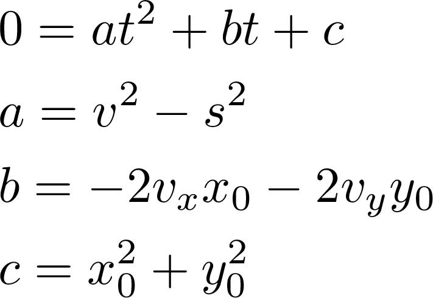
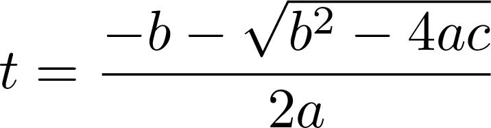
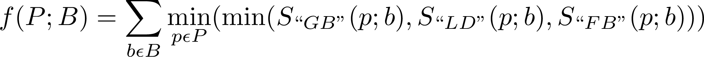
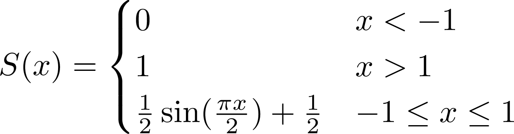

# :baseball: Auto-Generated Shifts for Baseball Batters :baseball:

## Overview
This project is designed to produce a defensive shift for a given set of batted balls. It assumes that the distribution of previous batted balls is a good predictor of the distribution of future batted balls. In order to produce a shift, it combines iterations of gradient descent and a clustering algorithm.

## Running the Code
To run the code, the command must follow the syntax: 

`python shift.py BATTER_NAME [{-y | --year} START_YEAR [NUM_YEARS]]`

where:
- `BATTER_NAME` is the batter's name in the format: `LAST_NAME,FIRST_NAME` (no space on either side of the comma, spaces in a player's name are fine: e.g. `La Stella,Tommy`)
- `START_YEAR` is the first year from which to collect data
- `NUM_YEARS` is the number of years, including the first year, from which to collect data

To change the fielders' parameters, edit `fielders.json`.

## Examples
### [Find examples here](https://mccapobianco.github.io/ShiftGenerator/)

## Gradient Descent
[Gradient Descent](https://en.wikipedia.org/wiki/Gradient_descent) is a method of finding a minimum of a function. In order to use this method, we need to define a function *f(P;B)* such that *P* is the set of player coordinates and *B* is the set of all batted balls. This function will use a variation of [wOBA](https://library.fangraphs.com/offense/woba/) to determine the total value produced by the batted balls given the fielders' locations. By applying gradient descent to this function, the fielders' location will move to spots where they can minimize the batter's wOBA.

### Modified wOBA Function
#### xwOBAhit
The basic idea of this function is that for each batted ball, the function determines whether a fielder can field the ball and retire the batter. If the batter is out, the value is zero. If the batter reaches, the value is determined by the wOBA variant.

wOBA has a few variants, namely [xwOBA and xwOBAcon](https://technology.mlblogs.com/an-introduction-to-expected-weighted-on-base-average-xwoba-29d6070ba52b). The basic idea of xwOBAcon is to determine the value of a batted ball based on its launch angle (*LA*) and exit velocity (*EV*). The xwOBAcon model uses a [k-Nearest Neighbor](https://en.wikipedia.org/wiki/K-nearest_neighbors_algorithm) regressor to predict the wOBA of a batted ball. I created my own model using a k-Nearest Neighbor regressor to predict the wOBA of a hit, or xwOBAhit. Since this function determines whether the batter reaches or not, it is not appropriate to use xwOBAcon. xwOBAcon factors in the chance that the batted ball results in an out, while we need the value of the ball given that it is a hit. Also, instead of using typical wOBA weights for my model, I used values only for the nobody on, nobody out Base-Out state, because that is a prime Base-Out state for shifting. The idea of using the xwOBAhit to evaluate a defensive alignment can be described mathmatically with the equation: 

#### Determining Outs
The physics of a batted ball is very complicated, which makes determining outs complicated. Simple projectile motion says that a ball hit wih LA=45 degrees and EV=100 MPH should travel about 670 feet. However, I found 3 such batted balls in 2019, and they averaged about 325 feet. In additional to gravity, batted balls are affected by other forces caused by spin and air resistance in the real world. Public Statcast data contains a lot of information, but it does not contain hang time. Professor Alan M. Nathan created a [Trajectory Calculator](http://baseball.physics.illinois.edu/trajectory-calculator.html) which determines the position of a batted ball based on a number of parameters. It does this by calculating the changes in very small increments (0.01 seconds). Instead of using this calculator directly, I wanted a simpler, continuous model of the ball's movement. I used Nathan's calculator to create an algebraic model of the ball's trajectory. After finding the hang time, I find the parabola that has the same hang time and I assume the ball follows this path.

From here, there are 3 cases to consider: fly ball, ground ball, line drive. A fly ball is the simplest case. To determine whether a player can catch the ball, we find how long it would take for the player to reach the dropspot, or where the ball hits the ground. If this value is less than the hang time, the ball will be caught. Determining line drives and ground balls start out the same way; what is the earliest the player can reach the ball? From an aerial view, the ball is travelling at a constant velocity since we are using a parabola to model the ball's path. So we need to solve for the time *t* it takes for a player with speed *s* to intersect a ball with velocity *v*, with the player's starting coordinates (*x0*, *y0*) and assuming an optimal approach angle *θ*. We can use the following system of equations to represent when the player's X and Y coordinates match the ball's:

By solving for *θ* and setting the equations equal, we can then use algebra to get this equation in the following form:

To solve for *t*, simply use the quadratic formula. Since we want the earliest the player can reach the ball, we only want the minus solution:

Using this time, we can find the height of the ball. If the height is between 0 and the player's vertical reach, our player catches the ball. This represents a line drive being caught. If the height is below 0, this represents the player fielding a ground ball. For simplicity, we assume the ball maintains the same horizontal velocity after each bounce. If the total time it takes to get the ball, gather, and throw is less than the batter's time to first, then the batter is out.

#### Differentiability
While it's easy to assign each hit a binary value of *"hit"* or *"out"*, this isn't too helpful wih gradient descent. The derivative is zero at all but one point. Gradient descent requires a slope to descend, so this function currently does not help our model learn. Instead of using this piecewise function, we can use an S-curve function, such as the [sigmoid function](https://en.wikipedia.org/wiki/Sigmoid_function). This is a function where the limit as x approaches negative infinity is zero and the limit as x approaches infinity is one. So, at the extremes, this is essentially the same as binary classification, but instead of jumping from 0 to 1, the function is continuous. We can use this function to determine weights, rather than a piecewise. Rather than comparing the hang time to the player's time to dropspot and giving a weight based on the comparison, we can center an S-curve on the hang time and plug in the player time. If the player time is much less than the hang time, then the player can get to the ball easily and the output of the S-curve function is almost 0. If the player time is much greater than the hang time, then the player will not get to the ball and the output is almost 1. If the two times are similar, the output will be somewhere in the middle. These hits will cause the biggest adjustments. By multiplying this output with the xwOBAhit value, we get an S-shaped function that behaves similar to the piecewise function in the xwOBAhit section above. The idea of this function can be described mathematically with the following equation:

##### "Sinemoid"
I found that there were issues when values were very positive or very negative. Gradients were returning NaN. In order to easily calculate gradients of extreme values, I replaced sigmoid with a piecewise function I call "sinemoid". I use a segment of a sine curve and two horizontal lines to create an S-shape function. At extreme values, the gradient is 0. The equation for sinemoid is shown below:

## Clustering
One issue that can occur is that fielders may move closer together. For example, both the right fielder and center fielder could move towards the right-center gap. While both players might be able to field more balls, there may also be more overlap in the set of balls each player can field. In an attempt to encourage the fielders to spread out, I implemented an algorithm motivated by [k-Means Clustering](https://en.wikipedia.org/wiki/K-means_clustering). This algorithm finds the set of balls for which a player is the most likely person to field the ball. If two or more players are equally likely, the ball belongs to neither set. The centroid of each player's set of balls is calculated and the player is moved closer to their centroid. The idea of this is to encourage players to center themselves in the set of balls for which they are responsible. In these iterations, balls that can be fielded by multiple people have less of an impact on the new alignment.
